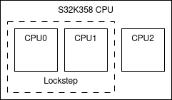
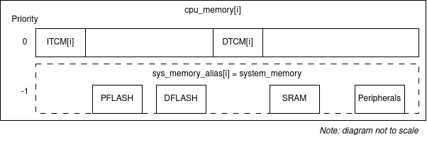
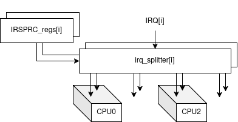
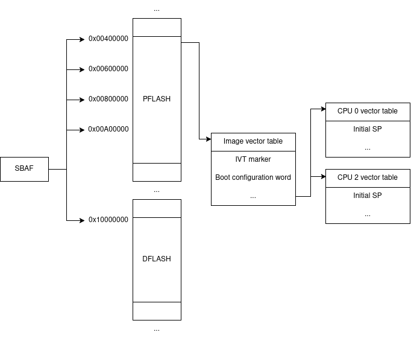

[](https://creativecommons.org/licenses/by-nc/4.0/)

# Table of Contents

# Overview

This project implements the NXP board [S32K3X8EVB](https://www.nxp.com/design/design-center/development-boards-and-designs/S32K3X8EVB-Q289) in QEMU, running a simple real-time program with FreeRTOS. Aspects of the implementation include:

- QEMU emulation: The default CPU S32K358 is implemented with a maximum of 2 cores. Implemented peripherals are 3 Periodic Interrupt Timers (PIT) and 16 Low-Power UART (LPUART), all with their respective interrupts as described in the reference manual. The CPU cores are based on the ARMv7M already existing in QEMU, with a simplified SBAF boot process and interrupt routing system.
- FreeRTOS: 
- Real-time program: 

# Installation & quickstart

## Installation

```
sudo apt install ABC
git clone XYZ
cd group2/qemu
mkdir build && cd build
../configure
make
```

## Running program

```
cd examples/Program
make build
make run
```

# Implementation details

## QEMU

The QEMU’s GitLab repository is cloned into our repository, so that we can keep track of our changes without making a separate fork.

### Machine & CPU

#### Machine initialization

The CPU uses the ARMv7M core provided by QEMU. The initialization of the board is similar to other ARM boards. We created the files [`s32k3x8.c`](./qemu/hw/arm/s32k3x8.c) and [`s32k3x8.h`](./qemu/include/hw/arm/s32k3x8.h) for the basic initialization. The files `Kconfig` and `meson.build` files in [/arm](./qemu/hw/arm/) are also modified to build the board. For this part, we took as reference the implementations [stm32f405_soc.c](./qemu/hw/arm/stm32f405_soc.c) and [mps2.c](./qemu/hw/arm/mps2.c).

The model for our following parts is the S32K358, which is the default CPU for the evaluation board. However, each part can easily be changed to model a different CPU with multiple cores, different memory layouts, different peripherals. 

#### Multiple CPUs and memory

The initialization receives the `-smp` parameter from the QEMU starting command, and up to 4 cores are supported (for up to S32K388). The S32K358 actually contains 3 cores, but CPU 0 and 1 are in lockstep and are effectively 1 CPU. Therefore, in the following sections we will refer to the two cores as CPU 0 and 2 (similar to the reference manual). By default, we only have 1 CPU (corresponding to `-smp 1`) for almost all the sample programs, so only CPU 0 is used.



According to the reference manual and the memory map, the following memory components are added in the machine:

|Memory|Base address|Size|Private/shared|Notes|
|-|-|-|-|-|
|SRAM|`0x20400000`|768 KB|Shared|SRAM 0,1,2 modeled together|
|Program flash|`0x00400000`|8 MB|Shared|4 blocks modeled together|
|Data flash|`0x10000000`|128 KB|Shared||
|ITCM|`0x00000000`|64 KB|Private||
|DTCM|`0x20000000`|128 KB|Private||

Similar to the implementations of [armsse.c](./qemu/hw/arm/armsse.c) and [mps3r.c](./qemu/hw/arm/mps3r.c), memory region aliases are needed for different views of the system memory. Each CPU sees the shared memory regions (Flash, SRAM, peripherals), but its private memory regions (ITCM, DTCM) have higher priorities.



#### Interrupt routing

According to the reference manual, in the real board the Miscellaneous System Control Module (MSCM) routes the peripherals' interrupts to one or multiple cores. These are controlled by the IRSPRC registers, one for each external interrupt line, and the 4 LSBs enable the routing to CPUs 0 to 3.

In our implementation, we emulate this using an array of 1x4 IRQ splitters:

```c
SplitIRQ irq_splitter[NUM_EXT_IRQ];
```

and they are connected to the cores according to the array of IRSPRC registers:

```c
static const uint8_t IRSPRC_reg[NUM_EXT_IRQ] = {
    [96] = 0b0101,
    ...
};
```

which identify which core(s) to direct the IRQ lines to. In the above lines, IRQ 96 (Timer 0) is connected to CPU 0 and 2. This is done for all the enabled IRQs.



#### SBAF boot process

According to the reference manual, a boot process named Secure Boot Assist Flash (SBAF) scans the following addresses:

```c
0x00400000 (PFLASH block 0)
0x00600000 (PFLASH block 1)
0x00800000 (PFLASH block 2)
0x00A00000 (PFLASH block 3)
0x10000000 (DFLASH)
```

and looks for the Image Vector Table (IVT), identified by the starting marker of `0x5AA55AA5`. It contains the boot configuration word that specifies which cores are enabled. It also contains the vector table addresses of each of the enabled cores.

We implemented a simple emulation of the SBAF. Its use is enabled by the flag:

```c
#define USE_SBAF                    0
```

in `s32k3x8.h`. If not enabled, the emulation will use the default vector table location of `0x00000000` for all cores. This means that, by default, all of the cores will run the same program if interrupts are set up the same way.

If enabled, an ELF parser will parse the provided ELF file and look for the IVT at only the address `0x00400000`. If the first 4 bytes matches `0x5AA55AA5`, the configuration word is read and the cores are enabled accordingly. Each of the cores' vector table is set through QEMU with the Vector Table Offset Register (VTOR), which has to be [properly aligned to 7 bits](https://developer.arm.com/documentation/ddi0403/d/System-Level-Architecture/System-Address-Map/System-Control-Space--SCS-/Vector-Table-Offset-Register--VTOR?lang=en). 



With SBAF enabled, the emulation works closer to the real board with each core having a separate vector table. However, the program's startup and linker files will need to be more complex. The linker needs to place the vector tables correctly. `examples/dualcore_program` is an example of this, with the two cores running different programs.

### Timers
The target timer emulated from the board was the Periodic Interrupt Timer (PIT). The timer operates as follows: when enabled, it begins counting down from the initial start value that has been set. When the timer period expires, the PIT sets the timer interrupt flag. Then it is reloaded at the start value, and the process starts again. It is necessary to note that the behavior implemented was only related to the ability to generate interrupts, and that each timer has independent timeout periods. 

### Implementation

The PIT timer definition was based on the MPS2 simple general-purpose 32-bit timer. According to the reference manual, in the memory map file, the PIT timers are located at the following addresses:

| Timer | Start address [Hex] | End address [Hex] |
| --- | --- | --- |
| PIT 0 | `0x400B0000` | `0x400B3FFF` |
| PIT 1 | `0x400B4000` | `0x400B7FFF` |
| PIT 2 | `0x402FC000` | `0x402FFFFF` |
| PIT 3 | `0x40300000` | `0x40303FFF` |

And driven by these interrupts (96, 97, 98, 99)  respectively. 

To define the timer and its behavior, a new hardware definition was created in `hw/timers/s32k3x8_timer.c`, and it was necessary to utilize QEMU's ptimer subsystem. The implementation creates a countdown timer device that can be memory-mapped into a virtual system, providing four main registers accessible at specific memory offsets (CTRL , VALUE, RELOAD, and INTSTATUS, equivalent to the s32k3x8 names TCTRLx, CVALx, LDVALx, and TFLGx, respectively). 

The primary functions defined are the following: `s32k3x8_timer_read()` `s32k3x8_timer_write()` `s32k3x8_timer_tick()`. The read function handles all memory-mapped register reads from the timer's registers. It decodes the memory offset to determine which register is being read and retrieves the appropriate value from either the timer's internal state or the underlying ptimer hardware, and returns it to the requesting software. 

The write function manages all writes to memory-mapped registers, interpreting the data value and memory address to update the relevant timer register and initiate the relevant hardware action. Each register has the following purpose: `VALUE` writes directly set the current timer count; `RELOAD` writes update the current count and the reload value; `INTSTATUS` writes clear interrupt flags using write-1-to-clear semantics; and `CTRL` register writings start or stop the timer.

The tick function is triggered when the countdown reaches zero. This callback checks if interrupts are enabled, sets the interrupt status flag, and triggers the actual interrupt to the CPU.

To create the timers needed on the board, it was necessary to edit the CPU code responsible for system integration. The first step in this implementation was to initialize each timer as a child object of the main system and assign a unique name to each one. The second loop then configured each timer by connecting it to the system clock. Activation and functionality of the timers are made possible through QEMU’s realization process (`sysbus_realize()`). Mapping is performed by assigning control registers to specific memory addresses that correspond to the real microcontroller's memory layout. Finally, each timer’s interrupt output is connected to an interrupt splitter, allowing them to generate interrupts upon expiration. This enables software emulation of interactions similar to those that would occur with actual hardware.

### Testing
The timer testing was done by implementing a basic functionality with a bare metal application for the functions that drive the timer. The idea was to set up three timers, each with its interrupt service routine running at different set timings. Every time a callback is done different variables are being updated and serial prints are done. The `main.c` configures the timers, enables the corresponding interrupts, and then enters an infinite loop. In the beginning, inline assembly was used to check in `gdb` if the individual peripheral timer was working correctly before incorporating it into the UART peripheral.

In the timer.c and timer.h are described, the functions to initialize and run the timers. Usually, hardware abstraction layers like CMSIS are useful to implement the peripherals faster. As we are not emulating the whole board, it was decided to extract just the 2 basic functions related to interrupts, interrupt enabling (`NVIC_EnableIRQ`) and priority setting (`NVIC_SetPriority`). These functions are handled manually via direct register writes to the NVIC’s `ISER` and `IPR` registers.

The interrupt configuration is handled in `startup.c`, which defines the vector table through a static array named `isr_vector`. This array maps system exception handlers and user-defined interrupt handlers in a fixed order. For the timers, entries such as `TIMER0_Handler`, `TIMER1_Handler`, and `TIMER2_Handler` are explicitly placed at their respective IRQ positions. This ensures each timer interrupt is correctly routed to its handler function when triggered.

### UARTs

The UART functionality implemented for s32k3x8 mcu which belongs to s32k3x8evb board.

First of all, in the s32k3x8.c file, the UART device is being created as a child object of mcu. Then it’s device property being set to “chardev” (character device). This way qemu will know and connect the frontend functionalities with the chardev backend functionalities. At last, realizing the memory of uart, and memory mapping is done with the base address of UART. After this mapping, the guest can access the UART device’s registers.


#### TX and RX
The uart device has its functionalities in hw/char/s32k3x8_uart.c file. These are mainly, reading and writing to the device’s registers, and Transmitting (TX) and Receiving (RX) capability. Transmitting is actually done with writing to the registers, and Receiving has its callback function.

s32k3x8_uart_read() and s32k3x8_uart_write() functions are the handler functions of this character device, qemu knows this functions from the MMIO table (s32k3x8_uart_ops).

In RX callback function uart_rx() checking if the rx_busy or not (This is related to baud-rate) If not busy, it is taking the data into the temporary buffer, and starting the timer. Until this timers finishes and interrupts its timer callback function, no other received messages are allowed. This way the baud-rate time-window is guaranteed. This time window is being set with the provided values in the Baud Rate Divider Register. The Qemu knows this uart_rx is the callback function from qemu_chr_fe_set_handlers().

```c
qemu_chr_fe_set_handlers(&s→chr, uart_can_receive, uart_rx, NULL, NULL, s, NULL, NULL);
```

For this callback to work, qemu expects a uart_can_receive function also, when that function returns 1, then the uart_rx is also being called. The busy flag is being controlled in the uart_can_receive function.


With uart_update_parameters() function, the chardev backend can be configured to match with the external UART device’s baudrate.


#### Interrupts
For interrupt implementation, first uart interrupts vector numbers are being found from the Interrupt table document of the MCU and added as an array. The RX and TX of the same UART are have the same interrupt number. These numbers are being used to connect the irq’s to the cpu, in the s32k3x8_init.

When the uart_rx() callback function is called, qemu_set_irq() is being set. Only if the interrupts enabled in the Status register STAT[TDRE]. The cpu, sets the program counter to handler function’s address when interrupt happens. For this to work, guest side should enable cpu’s interrupts, with setting the respected register addresses for cortex-m7. Also the vector table should be modified, with the UART handler function.

#### Testing

To test all the functionalities, the example program is given in the UART_INT_TEST. The test implemented on top of the timer example program.

In UART.c, there are init, print and handler functions. The respected values written in the UART register memory and interrupts enabled in init. To test the baud-rate function, there is given two different value for BDR (BaudRate-Diviso-Register). When the slower baud-rate is chosen, the test is giving a noticable delay. Print function is just writing the value into the register byte by byte. Handler function is printing the received value from the UART_RX.

To test this UART, while runnning the qemu with the programs executable file (main.elf) "-serial stdio" flag is added. This way the terminal is connected into qemu and acts as a serial input and output. With keyboard strokes, the sent message can be seen in the terminal.


## FreeRTOS & program

### FreeRTOS

As part of the project, FreeRTOS was successfully configured to run on the NXP S32K3X8 microcontroller, which is based on the Arm Cortex-M7 core. A central part of this process was creation of **Makefile**, which defined how the FreeRTOS kernel should be built and linked for our board. This file was crucial because it allowed precise control over the toolchain, architecture settings, memory layout, and build outputs, ensuring the resulting firmware could run both on real hardware and under QEMU emulation.

The first major change in the Makefile was selecting the correct FreeRTOS port layer for the Cortex-M7 core. This was done by setting the port directory to `portable/GCC/ARM_CM7/r0p1`, which provides FreeRTOS with the appropriate context-switch code for M7-class devices. Unlike Cortex-M3, the M7 supports more advanced features such as a hardware floating-point unit (FPU). The necessary compiler flags were added to enable it: `-mfpu=fpv5-sp-d16 -mfloat-abi=hard`. These flags enable single-precision hardware floating point and trigger what’s known as lazy FPU register stacking, which improves performance by only saving FPU registers during context switches when needed.

The Makefile also explicitly targets our silicon using the following configuration:

```makefile
MACHINE := S32K3X8  
CPU     := cortex-m7
```

These variables ensure that both the compiler (`arm-none-eabi-gcc`) and the QEMU emulator are aligned with the hardware configuration of the S32K3 board. This avoids issues that could arise from compiling for a generic M-series target. Additionally, we used a custom linker scripts (`linker_rtos.ld` and `mps2_m7.ld`) tailored for the memory layout of the S32K3X8, including PFLASH, DFLASH, RAM, ITCM, and DTCM regions. Using a correct memory map is needed to avoid hard faults that often occur when firmware tries to access invalid or unmapped memory addresses.

Given that the M7 core and FPU introduce more code overhead than the simpler M3, size optimizations were also integrated into the Makefile. Compiler options like `-Os` (optimize for size) and section-level optimizations (`-ffunction-sections -fdata-sections`) were combined with the linker flag `--gc-sections` to remove unused functions and variables. This helped keep the final firmware image within reasonable flash limits, despite the added complexity of the M7 support.

To make testing possible, several helper targets were included in the Makefile. The `qemu_start` and `qemu_debug` targets allow launching the compiled `.elf` file in a QEMU environment emulating the S32K3X8 board, with the second target offering GDB debugging support. These additions made it easy to verify the build and behavior of the RTOS without needing immediate access to physical hardware. The `clean` target removes all build files from the output directory.

Important step towards running FreeRTOS on our board was writing up a **linker file** too. Throughout our examples and freeRTOS apps 2 linker scripts can be seen (`linker_rtos.ld` and `mps2_m7.ld`). The first one is version of the linker file to run 2 core microprocessor, and the other one was for 1 core. In the next part, we are going to describe only the 2 core version. This script was written by following the official S32K3 Reference Manual, ensuring that memory regions match the hardware’s actual configuration.

The script begins by defining the memory regions using the `MEMORY` block. Flash memory is mapped at address `0x00400000`, and SRAM starts at `0x20400000`, consistent with the S32K3X8 memory map. These values ensure that the `.text`, `.data`, and `.bss` sections are loaded into the correct physical addresses. A special note was taken to align the RAM size and start address to the reference manual so that FreeRTOS stacks and heaps are placed in valid, accessible memory.

Next, the script defines the section layout under `SECTIONS`. The `.text` section is placed in flash, which includes all code and read-only data. The `.data` section is loaded to flash but relocated to RAM at runtime. The `.bss` and `.heap` are placed in SRAM, which is also where the FreeRTOS task stacks are allocated.

Attention was also given to ensure alignment and proper initialization of symbols like `_end`, `_stack_start`, and `_heap_start`, which are important for the FreeRTOS memory allocator (`heap_4.c`) and general stack usage. These symbols help ensure that runtime components behave predictably and safely.

The **startup file** is a crucial final piece in making FreeRTOS run correctly on the S32K3X8. It begins by defining the interrupt vector table for both CPUs, which maps all core exceptions and peripheral interrupts—including those used by FreeRTOS like PendSV, SysTick, and SVC—to their respective handlers. 

### FreeRTOS Config

As part of configuring FreeRTOS for the S32K3X8 (Cortex-M7), we encountered a problem where the system would halt during initialization, specifically at the assertion `configASSERT( ucMaxSysCallPriority )`. This pointed to a misconfiguration of interrupt priority masking. Initially, the project used a hardcoded value:

```
#define configMAX_SYSCALL_INTERRUPT_PRIORITY (4)  
```

The NVIC uses an 8-bit field where only the upper bits are implemented (in our case, 4 bits), and these must be **left-aligned**. Using the literal value `4` resulted in an incorrectly formatted priority (`0x04`) that did not properly set the BASEPRI register, which FreeRTOS relies on to mask interrupts during critical sections. This invalid configuration caused the assertion to fail, halting execution.

To resolve this, we followed the CMSIS recommendation and redefined the configuration using proper shifting:

```
#define configPRIO_BITS 4  
#define configLIBRARY_MAX_SYSCALL_INTERRUPT_PRIORITY 0b0001  
#define configMAX_SYSCALL_INTERRUPT_PRIORITY (configLIBRARY_MAX_SYSCALL_INTERRUPT_PRIORITY << (8 - configPRIO_BITS))  
```

This shift left-aligns the priority level `1` into the correct 8-bit format (`0x10`), ensuring that BASEPRI is set correctly and that FreeRTOS can safely mask high-priority interrupts. After this change, the assertion passed and the system ran as expected. 

### Simple App

As at first we did not have implemented UART, we tried to run FreeRTOS with a simple application which just had one task incrementing a global variable every second. After we verified this version works, we proceeded with a more complex apps once we had all the peripherals implemented.

### Program
Inside `App/` you can find a simple demo app running FreeRTOS to test the
correct implementation of UART and Timers.<br>
The app is creating a simple task keeping the CPU busy. It computes
numbers from Fibonacci series with an empty loop making sure the process keeps
running without computing it too fast. Since the computation uses 32-bit values,
we get overflow pretty fast. When an overflow is about to happen, the series
computation restarts updating the occurred iteration count. This happens without
any visual feedback.<br>
Here timer interrupts come into play. We set three different timers with
different period triggering three different behaviours:
- **Timer 0**: timer 0 causes an on-screen print of the context registers
- **Timer 1**: timer 1 prints the value of the last computed Fibonacci
number alongside with the iteration the task is currently in
- **Timer 2**: timer 2 causes an on-screen print of the memory content

To run the example make sure to have cloned this repository with
```sh
git clone --recurse-submodules https://baltig.polito.it/eos2024/group2.git
```
so that the full FreeRTOS source code is downloaded to your machine, then execute the following

```sh
cd App/
make all
make qemu_start
```

The app will ask you for an input to start the demo, then you can stop it anytime with `Ctrl+C`.

# License

All contents in this repository are licensed under [CC BY-NC 4.0](https://creativecommons.org/licenses/by-nc/4.0/) license.
The **Creative Commons Attribution-NonCommercial 4.0 International** allows
anyone to:
- **Share**: copy and redistribute the material in any medium or format.
- **Adapt**: remix, transform, and build upon the material.

The following terms are applied:
- **Attribution**: You must give appropriate credit, provide a link to the license, and indicate if changes were made. You may do so in any reasonable manner, but not in any way that suggests the licensor endorses you or your use.
- **NonCommercial**: You may not use the material for commercial purposes.
- **No additional restrictions**: You may not apply legal terms or technological measures that legally restrict others from doing anything the license permits.

For more details, refer to the [LICENSE.md](/LICENSE.md) file.
